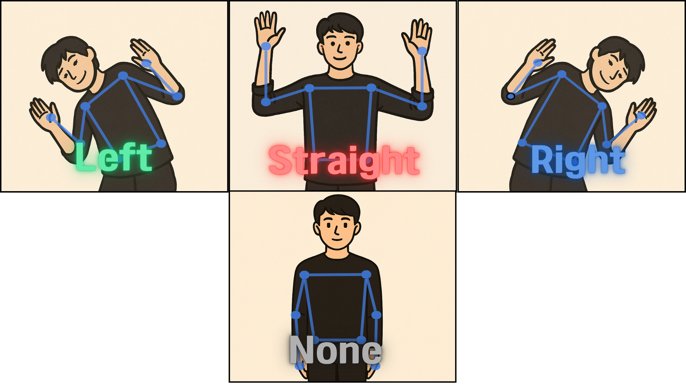

# DeepRacer Pose Control

A web-based control system for AWS DeepRacer that uses real-time pose estimation to control vehicle movement. This project combines computer vision and machine learning to enable hands-free control of the DeepRacer through body gestures captured via webcam.



**preview:**

<https://aicastle-school.github.io/deepracer-pose-control/>

**Key Features:**
- **Pose-based Control**: Uses Teachable Machine pose estimation model to recognize body gestures (Forward, Left, Right, NONE)
- **Real-time Video Streaming**: Live camera feed from DeepRacer's front camera with MJPEG streaming
- Live pose estimation canvas with skeleton visualization
- Real-time prediction charts showing gesture confidence levels
- Vehicle camera stream with speed/angle indicators


## Install
```bash
pip install -r requirements.txt
```

## Setup `.env`
- `VEHICLE_IP`: IP address of the vehicle. (ex: `192.168.1.2`)
- `VEHICLE_PASSWORD`: Password of the vehicle console. (ex: `etbsjmR6`)
- `SSH_PASSWORD`: Password of the vehicle SSH.
  > enable SSH access in the DeepRacer Vehicle Console and set a password in advance. 
- `PORT`: Port for Webserver (default: `5000`)
- `IMAGE_WIDTH`: Width of the image. (default: `320`)
- `IMAGE_HEIGHT`: Height of the image. (default: `240`)


## Init
```bash
python init.py
```
> The default API allows only discrete steering‑angle and speed commands based on threshold values; update it so that continuous angle and speed inputs are accepted.


## Run
```bash
python run.py
```
This will start a web server on the specified port and open the web interface in your default browser.
- <http://localhost:5000/>
- <http://127.0.0.1:5000/>

> If you are using a different port, change the port in the URL.